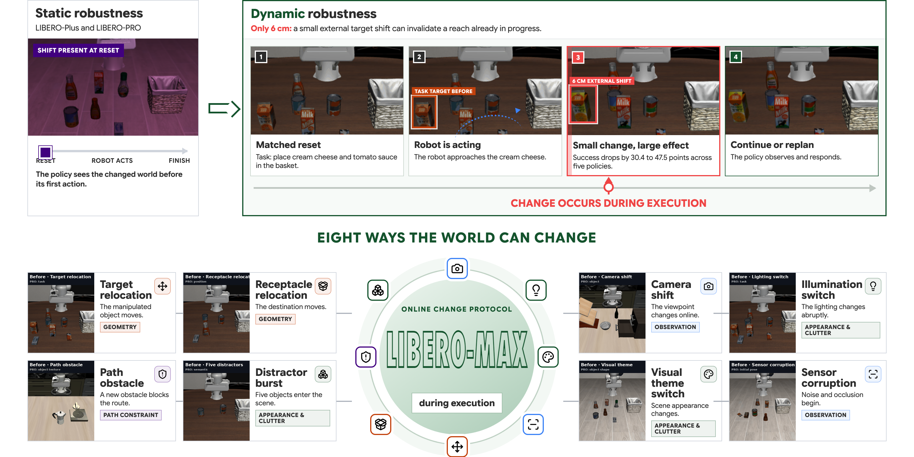
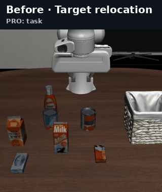
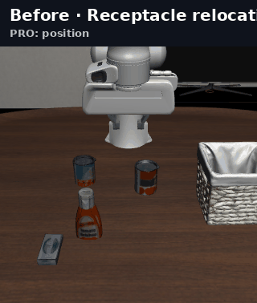
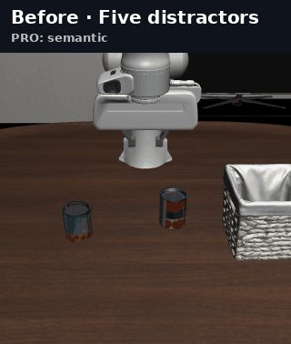
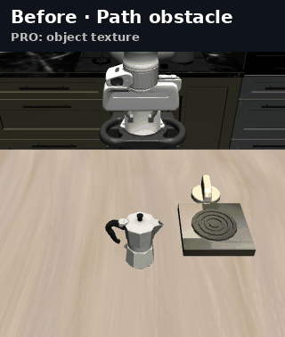
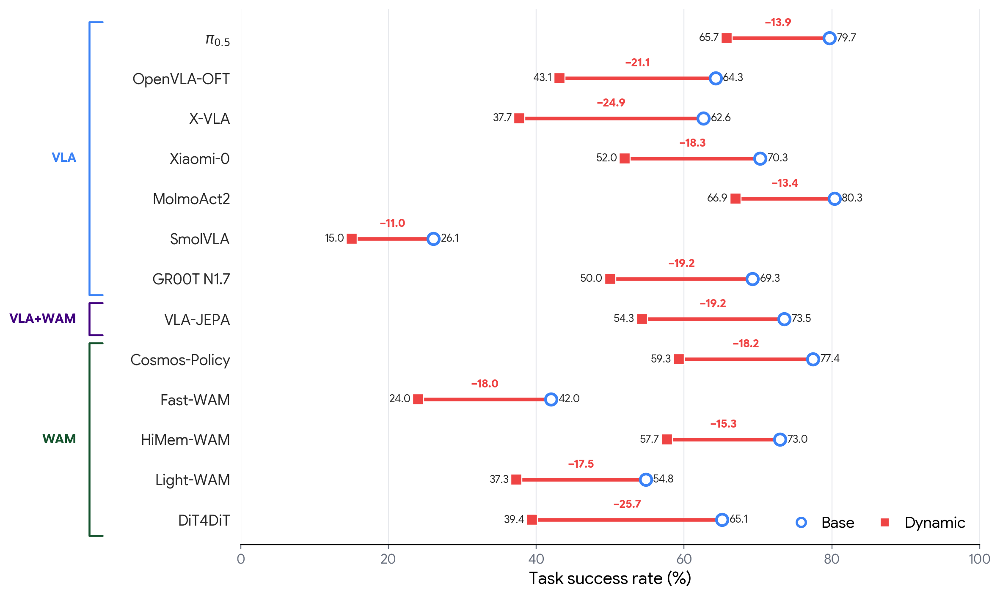
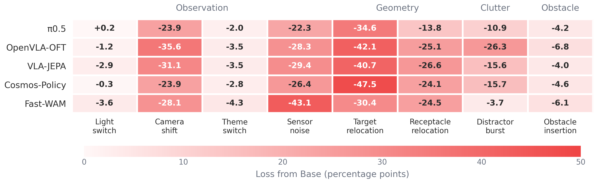
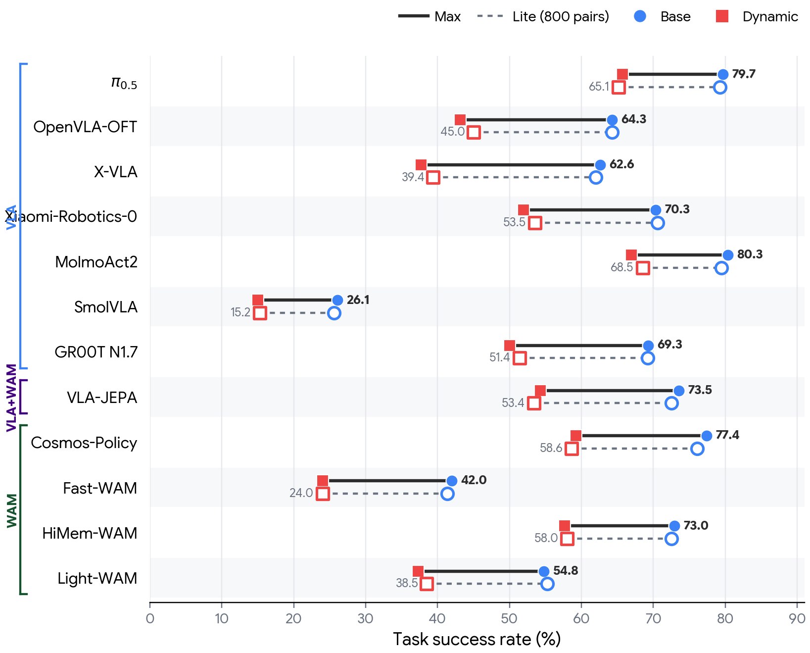

<div align="center">

# LIBERO-MAX: Do Robot Policies Adapt When the World Changes?

**A paired benchmark for dynamic robustness during robot execution**

[](#citation)
[](benchmark/max8000)
[](#benchmark)
[](benchmark/lite)
[](#main-results)
[](https://yunbeizhang.github.io/LIBERO-MAX/)
[](https://github.com/yunbeizhang/LIBERO-MAX/actions/workflows/ci.yml)

[[Dataset](benchmark/max8000)]
[[Project website](https://yunbeizhang.github.io/LIBERO-MAX/)]
[[Benchmark specification](docs/BENCHMARK_SPEC.md)]
[[Evaluation guide](docs/RUNTIME_INTEGRATION.md)]
[[Paper PDF: coming soon](#citation)]

</div>

<p align="center">
  
</p>

Robot benchmarks usually present a fixed world at reset. LIBERO-MAX asks a
different question: **can a policy recover when the world changes after the
robot has already started acting?** Each Dynamic episode is evaluated against
a Base control with the same task, simulator state, policy seed, and action
prefix before the change.

## News

- **2026-08-31:** Released **LIBERO-MAX Lite**, a fixed 800-pair subset that
  uses 10% of the Max rollout budget, together with audited Max--Lite results
  for twelve checkpoints.
- **2026-08-30:** Expanded the complete 8,000-pair comparison from five to
  **thirteen VLA, VLA + WM, and WAM checkpoints**.
- **2026-08-20:** Expanded the complete 8,000-pair evaluation to **ten**
  VLA/WAM checkpoints and released a model-agnostic dynamic GPU scheduler.
- **2026-08-15:** Released the **LIBERO-MAX dataset** and complete 8,000-pair
  evaluation results across five VLA/WAM models: **π0.5**, **OpenVLA-OFT**,
  **VLA-JEPA**, **Cosmos-Policy**, and **Fast-WAM**.

## To Do

- **Coming soon:** Paper PDF and BibTeX.

## Benchmark

LIBERO-MAX contains **8,000 Dynamic episodes**. During evaluation, every
Dynamic episode receives one matched Base control, producing **8,000 pairs and
16,000 scored rollouts per checkpoint**. The robot begins from the same state
and executes the same action prefix in both arms. Only the Dynamic arm applies
one feasible change during execution.

We release two evaluation tracks. **LIBERO-MAX**, shortened to **Max**, is the
complete benchmark and remains the primary reporting track. **LIBERO-MAX
Lite**, shortened to **Lite**, is a fixed 800-pair subset for rapid model
integration, ablation, and early comparison. Lite keeps 100 cases per event and
the 70:30 LIBERO-Plus to LIBERO-PRO composition of Max. It requires 1,600 scored
rollouts per checkpoint, ten percent of the Max evaluation cost.

| Evaluation track | Matched pairs | Scored rollouts | Use |
| --- | ---: | ---: | --- |
| **Max** | **8,000** | **16,000** | Primary benchmark reporting |
| **Lite** | **800** | **1,600** | Integration, ablation, early comparison |

| Source benchmark | Dynamic cases | Contribution |
| --- | ---: | --- |
| LIBERO-Plus | 5,600 | Controlled visual, scene, and observation variations |
| LIBERO-PRO | 2,400 | Controlled semantic and geometric source variations |
| **LIBERO-MAX** | **8,000** | **Eight changes applied after execution begins** |

The dataset is balanced with 1,000 cases for each event type:

| Family | Online changes |
| --- | --- |
| Observation | Camera shift; sensor corruption |
| Geometry | Target relocation; receptacle relocation |
| Appearance and clutter | Illumination switch; visual theme switch; distractor burst |
| Path constraint | Obstacle insertion |

### Lineage and acknowledgements

LIBERO-MAX is an extension layer rather than a fork of one upstream codebase.
The dynamic event runtime, paired replay protocol, frozen manifests,
aggregation, and validation in `src/libero_max` were developed for this
project. Max evaluation loads the upstream benchmarks as external runtime
dependencies:

| Foundation | Contribution | Paper | Code |
| --- | --- | --- | --- |
| LIBERO | Robot tasks, simulator environment, demonstrations, and success predicates | [paper](https://arxiv.org/abs/2306.03310) | [repository](https://github.com/Lifelong-Robot-Learning/LIBERO) |
| LIBERO-Plus | Pinned source catalog for 5,600 MAX cases | [paper](https://arxiv.org/abs/2510.13626) | [repository](https://github.com/sylvestf/LIBERO-plus) |
| LIBERO-PRO | Pinned semantic, geometric, and visual substrate for 2,400 MAX cases | [paper](https://arxiv.org/abs/2510.03827) | [repository](https://github.com/Zxy-MLlab/LIBERO-PRO) |

We thank the authors of all three benchmarks for making their datasets and
code available. Exact source revisions and the attribution boundary are
documented in [`ACKNOWLEDGEMENTS.md`](ACKNOWLEDGEMENTS.md).

<table>
  <tr>
    <td align="center" width="25%"><br><b>Target relocation</b></td>
    <td align="center" width="25%"><br><b>Receptacle relocation</b></td>
    <td align="center" width="25%"><br><b>Distractor burst</b></td>
    <td align="center" width="25%"><br><b>Obstacle insertion</b></td>
  </tr>
</table>

The animations show deterministic MuJoCo intervention states rather than
selected policy successes. All eight visualizations are available in
[`assets/media`](assets/media).

## Main results

Every model is evaluated on the complete set of 8,000 matched pairs. Success
rate is computed over the full denominator, so a policy that never reaches the
event trigger remains an end-to-end failure.

| Family | Model | Base SR ↑ | Dynamic SR ↑ | Gap |
| --- | --- | ---: | ---: | ---: |
| VLA | π0.5 | 79.7 | 65.7 | −13.9 |
| VLA | OpenVLA-OFT | 64.3 | 43.1 | −21.1 |
| VLA | X-VLA | 62.6 | 37.7 | −24.9 |
| VLA | Xiaomi-Robotics-0 | 70.3 | 52.0 | −18.3 |
| VLA | MolmoAct2 | **80.3** | **66.9** | −13.4 |
| VLA | SmolVLA | 26.1 | 15.0 | −11.0 |
| VLA | GR00T N1.7 | 69.3 | 50.0 | −19.3 |
| VLA + WM | VLA-JEPA | 73.5 | 54.3 | −19.2 |
| WAM | Cosmos-Policy | 77.4 | 59.3 | −18.2 |
| WAM | Fast-WAM | 42.0 | 24.0 | −18.0 |
| WAM | HiMem-WAM | 73.0 | 57.7 | −15.3 |
| WAM | Light-WAM | 54.8 | 37.3 | −17.5 |
| WAM | DiT4DiT | 65.1 | 39.4 | −25.7 |

<p align="center">
  
</p>

All thirteen policies lose **11.0 to 25.7 success-rate points** when the world
changes during execution. No family dominates across all events. Relocation,
camera shift, and sensor corruption expose the largest shared weaknesses. The
compact source data for the table and plots is available in
[`assets/figures/main_results.json`](assets/figures/main_results.json).

<p align="center">
  
</p>

### Lite validation

Lite uses the same frozen case IDs and the same native checkpoint settings as
Max. Only the evaluation set changes: each Lite checkpoint scores 800 matched
pairs, or 1,600 rollouts. Across the twelve checkpoints with audited Lite
records, the largest absolute Max--Lite deviation over Base success, Dynamic
success, and the paired gap is 2.4 percentage points. The Dynamic ordering has
one adjacent swap: Xiaomi-Robotics-0 and VLA-JEPA are separated by 0.1 points
on Lite.

| Model | Max Base | Lite Base | Max Dynamic | Lite Dynamic | Max gap | Lite gap |
| --- | ---: | ---: | ---: | ---: | ---: | ---: |
| π0.5 | 79.7 | 79.3 | 65.7 | 65.1 | −13.9 | −14.1 |
| OpenVLA-OFT | 64.3 | 64.3 | 43.2 | 45.0 | −21.1 | −19.3 |
| X-VLA | 62.6 | 62.0 | 37.7 | 39.4 | −24.9 | −22.6 |
| Xiaomi-Robotics-0 | 70.3 | 70.6 | 52.0 | 53.5 | −18.3 | −17.1 |
| MolmoAct2 | 80.3 | 79.5 | 66.9 | 68.5 | −13.4 | −11.0 |
| SmolVLA | 26.1 | 25.6 | 15.0 | 15.3 | −11.0 | −10.4 |
| GR00T N1.7 | 69.3 | 69.3 | 50.0 | 51.4 | −19.3 | −17.9 |
| VLA-JEPA | 73.5 | 72.5 | 54.3 | 53.4 | −19.2 | −19.1 |
| Cosmos-Policy | 77.4 | 76.1 | 59.3 | 58.6 | −18.2 | −17.5 |
| Fast-WAM | 42.0 | 41.4 | 24.0 | 24.0 | −18.0 | −17.4 |
| HiMem-WAM | 73.0 | 72.5 | 57.7 | 58.0 | −15.3 | −14.5 |
| Light-WAM | 54.8 | 55.3 | 37.3 | 38.5 | −17.5 | −16.8 |

<p align="center">
  
</p>

The exact values are available in
[`assets/figures/max_lite_validation.csv`](assets/figures/max_lite_validation.csv).
Max remains the primary reporting track; Lite is intended for integration,
debugging, ablation, and early comparison.

The repository focuses on the benchmark contract rather than redistributing
model implementations or weights. These reference adapters demonstrate the
common shard interface used in the reported evaluations:

| Model | Family | Evaluation launcher |
| --- | --- | --- |
| π0.5 | VLA | [`run_openpi_persistent_benchmark.sh`](scripts/run_openpi_persistent_benchmark.sh) |
| OpenVLA-OFT | VLA | [`run_openvla_oft_persistent_benchmark.py`](scripts/run_openvla_oft_persistent_benchmark.py) |
| X-VLA | VLA | [`run_xvla_persistent_shard.py`](scripts/run_xvla_persistent_shard.py) |
| VLA-JEPA | VLA + WM | [`run_vlajepa_persistent_benchmark.py`](scripts/run_vlajepa_persistent_benchmark.py) |
| Cosmos-Policy | WAM | [`run_cosmos_persistent_benchmark.py`](scripts/run_cosmos_persistent_benchmark.py) |
| Fast-WAM | WAM | [`run_fastwam_persistent_benchmark.py`](scripts/run_fastwam_persistent_benchmark.py) |

## Quick start

The benchmark manifest, schema validation, aggregation logic, and unit tests
run without downloading model weights.

```bash
git clone https://github.com/yunbeizhang/LIBERO-MAX.git
cd LIBERO-MAX

python3 -m venv .venv
source .venv/bin/activate
pip install -e .

# Validate the frozen release and its checksums.
make validate-max8000

# Validate the fixed lightweight track.
make validate-lite

# Run the repository test suite.
make test
```

Inspect the complete release through the command line:

```bash
libero-max validate-manifest benchmark/max8000/libero_max_8000.json
libero-max validate-manifest benchmark/lite/libero_max_lite.json
```

## Reproducing an evaluation

Model weights and upstream repositories are not redistributed here. A model
adapter consumes one manifest shard, writes terminal `DONE` or `FAILED`
markers, and supports `--resume`. The generic scheduler uses every GPU visible
through `CUDA_VISIBLE_DEVICES` by default and dynamically assigns suite shards
as workers finish.

Start with Lite when integrating a checkpoint. The following example evaluates
X-VLA on all 800 Lite pairs:

```bash
python scripts/run_dynamic_benchmark.py \
  benchmark/lite/libero_max_lite.json \
  --runner scripts/run_xvla_persistent_shard.py \
  --output-root artifacts/xvla-lite \
  -- \
  --lerobot-root /path/to/lerobot \
  --checkpoint /path/to/xvla-libero-checkpoint \
  --query-interval 30
```

Keep the model checkpoint, action horizon, query interval, and all other
serving settings identical when moving from Lite to Max. To run the complete
track, change the manifest and output directory:

```bash
python scripts/run_dynamic_benchmark.py \
  benchmark/max8000/libero_max_8000.json \
  --runner scripts/run_xvla_persistent_shard.py \
  --output-root artifacts/xvla \
  -- \
  --lerobot-root /path/to/lerobot \
  --checkpoint /path/to/xvla-libero-checkpoint \
  --query-interval 30
```

Use `--gpus 0,2` to override automatic discovery. A valid Lite evaluation must
finish all 800 case IDs in both the Base and Dynamic arms; failed or missing
cases remain in the full denominator rather than being dropped. A new model can
integrate by implementing the same shard CLI; the scheduler does not import or
special-case the policy. See the [`Lite guide`](benchmark/lite/README.md) and
the [`evaluation guide`](docs/RUNTIME_INTEGRATION.md) for the adapter contract,
simulator requirements, dependency isolation, paired replay checks, and
aggregation. Generated rollouts belong under `artifacts/`, which is ignored by
Git.

## Repository structure

```text
LIBERO-MAX/
├── benchmark/max8000/   # Frozen 8,000-case release and integrity metadata
├── benchmark/lite/      # Fixed 800-pair rapid-evaluation track
├── src/libero_max/      # Dynamic interventions, runtime, schemas, aggregation
├── scripts/             # Dataset builders, reference adapters, and GPU scheduler
├── assets/              # Benchmark figures and MuJoCo animations
├── docs/                # Protocol and runtime documentation
├── examples/            # Small manifests and paired-result examples
├── tests/               # Unit, integration, and release-integrity tests
└── index.html            # GitHub Pages project website
```

The public repository intentionally excludes raw rollout traces and generated
paper artifacts. This keeps the code release compact while preserving the
frozen benchmark, the complete evaluation logic, and every launcher required
to reproduce the reported experiments.

## Citation

The paper PDF and verified BibTeX entry will be added with the manuscript
release. Until then, please cite the repository and dataset release:

```text
LIBERO-MAX Dataset
LIBERO-MAX: Do Robot Policies Adapt When the World Changes?
https://github.com/yunbeizhang/LIBERO-MAX
```
